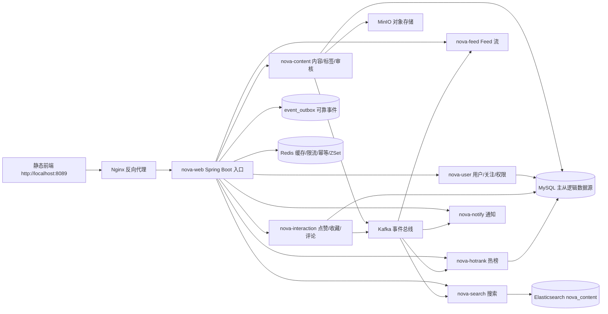
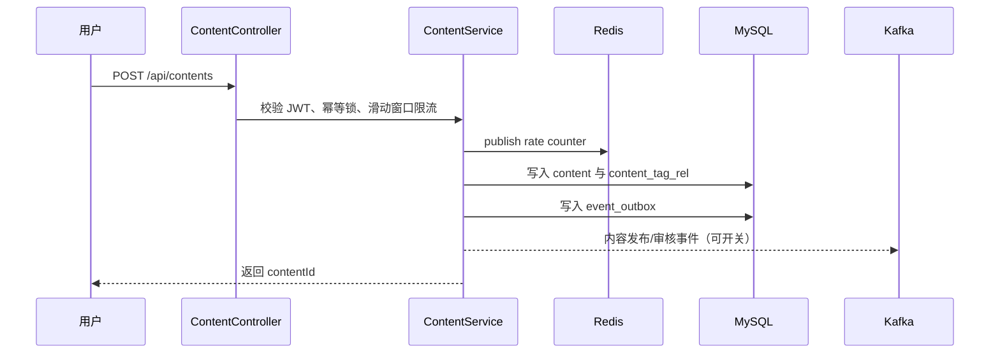
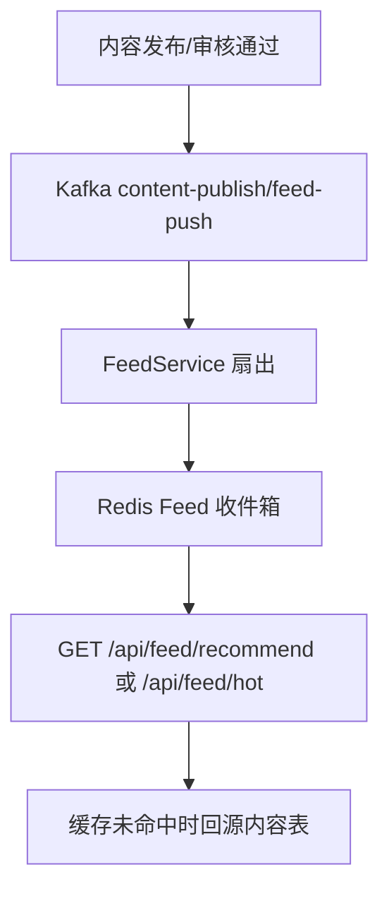
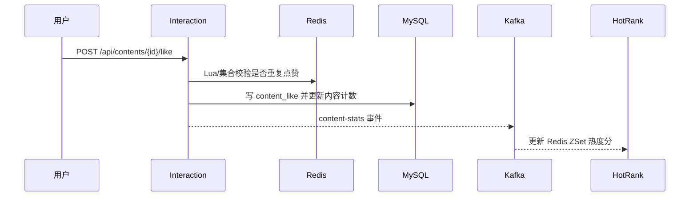
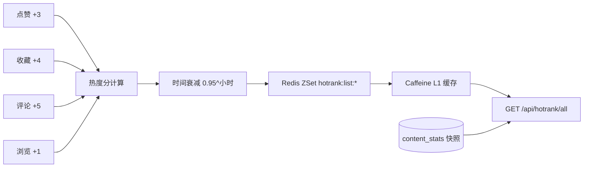
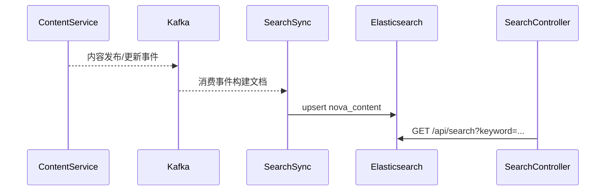
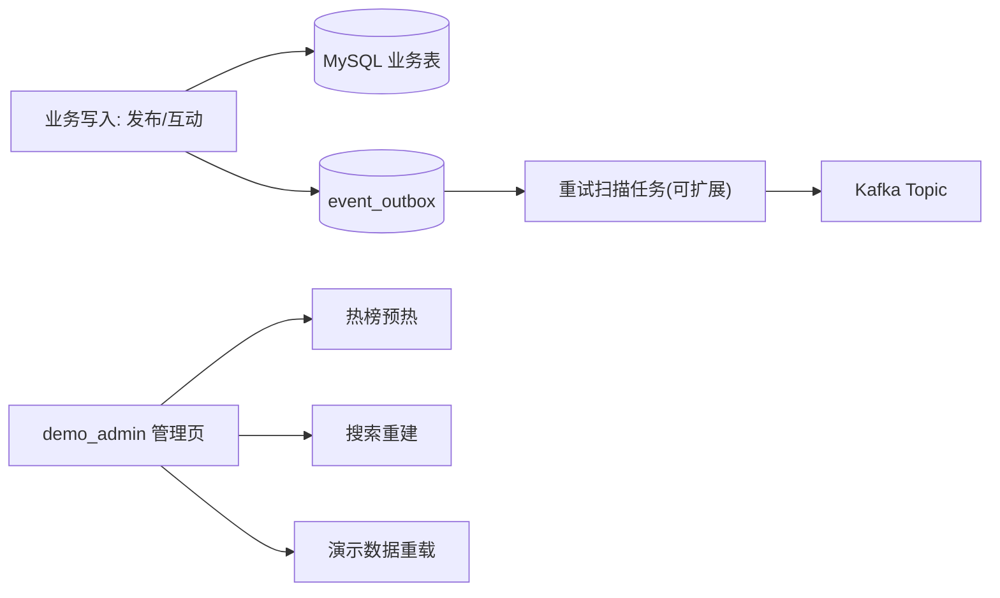

# NovaHub 架构说明

本文档面向简历展示和面试讲解，说明 NovaHub 的模块划分、核心链路和高并发设计取舍。

## 模块架构



## 发布内容链路



关键点：

- `@Idempotent` 防止重复提交，Redis 锁短 TTL 释放。
- 发布限流按用户维度计数，避免单用户刷写。
- 提交审核同步落 `event_outbox`，Kafka 不可用时仍保留可重试事件记录。
- 草稿 `status=0`，提交审核 `status=1`，通过后 `status=2`。
- 演示数据直接写入已发布状态，保证 fresh volume 首页可见。

## Feed 推送链路



设计取舍：

- 关注流适合写扩散，发布后按粉丝关系写入收件箱。
- 推荐流保留召回/排序接口，简历演示环境优先保证可用性。
- 热门流可复用热榜结果，减少重复排序计算。

## 点赞统计链路



关键点：

- 用户点赞集合和内容点赞集合用于快速判断状态。
- 数据库表保留唯一键 `uk_user_content`，作为最终一致性的兜底。
- 写入后发统计事件，热榜和通知异步处理，降低主链路耗时。

## 热榜计算链路



热度公式：

```text
newScore = (currentScore + delta) * 0.95 ^ hoursElapsed
delta = like * 3 + collect * 4 + comment * 5 + view * 1
```

演示环境增强：

- Redis 有数据时优先读 Redis ZSet。
- Redis 为空时回落到 `content_stats`，fresh Docker volume 也能展示热榜。
- Caffeine 作为进程内 L1 缓存，降低热点榜单的 Redis 压力。
- 应用启动和管理员操作均可从 `content_stats` 预热 Redis ZSet，减少冷启动首屏抖动。

## 搜索索引同步链路



搜索 mapping：

- 默认使用 Elasticsearch 内置 `standard` analyzer，避免官方镜像缺少 IK 插件导致索引创建失败。
- `title`、`authorNickname`、`tagNames` 保留 `keyword` 子字段，便于精确匹配和后续聚合。
- 如果后续需要强化中文召回，可自定义 ES 镜像安装 IK，再把 analyzer 切换为对应的 IK 分词配置。
- 管理演示页可触发 bulk rebuild；生产化版本建议使用新索引 + alias 切换，失败时保留旧索引承接查询。

## 可靠事件与管理演示



- outbox 记录事件类型、聚合 ID、payload、状态、重试次数和失败原因，当前发布审核事件已落表。
- 定时任务会扫描待投递/失败事件并重试 Kafka 投递，失败时更新重试次数、下次重试时间和错误信息。
- 管理接口包括 `/api/admin/hotrank/prewarm`、`/api/admin/search/rebuild`、`/api/admin/demo-data/reload`。
- 管理接口通过 RBAC 校验，仅 `ROLE_ADMIN` 可执行，普通演示用户只读。

## 可观测性

- `TraceIdFilter` 为每个请求生成或透传 `X-Request-Id`、`X-Trace-Id`。
- `Result` 响应体会携带 `requestId` 和 `traceId`，前端报错可以直接带给后端排查。
- Logback pattern 已输出 `traceId`、`requestId`、`userId`，便于定位慢接口和异常链路。
- SkyWalking 保留为 Docker 可选能力，默认演示优先保证主链路稳定。

## 缓存与一致性

| 场景 | 策略 |
|------|------|
| 内容详情 | Redis 缓存 + 空值缓存 + 短锁防缓存击穿 |
| 用户互动状态 | Redis Set 快速判断，MySQL 唯一键兜底 |
| 热榜 | Redis ZSet 主读，Caffeine L1，DB 快照回落 |
| Feed 收件箱 | Redis List/ZSet 保存近期 Feed，过期或未命中回源 |
| 删除/更新内容 | 删除详情缓存，必要时延迟双删降低脏读概率 |

## 限流、幂等与异步化

| 能力 | 实现方式 | 价值 |
|------|----------|------|
| 接口限流 | 滑动窗口注解 + Redis 计数 | 防止发布、点赞接口被刷 |
| 幂等控制 | Redis 锁 + 业务唯一键 | 防重复提交和重复点赞 |
| 异步事件 | Kafka topic 拆分内容、统计、Feed、通知、搜索 | 主链路轻量，旁路系统可独立扩展 |
| 监控 | Actuator + Micrometer + SkyWalking | 定位慢接口、慢 SQL 和错误率 |

## 面试讲解主线

1. 从产品功能讲起：用户在首页浏览内容，登录后可以发布、评论、点赞收藏。
2. 再讲核心链路：写内容进入审核和事件流，互动行为异步影响热榜、通知、搜索。
3. 最后讲工程化：Docker 一键启动、演示数据、压测报告、缓存回落、端口冲突与乱码处理。
